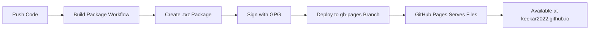

# GitHub Pages Setup for Package Repository

This guide explains how to enable GitHub Pages to host your FreeBSD package repository.

---

## Overview

**Repository URL:** `https://keekar2022.github.io/KACI-Parental_Control/packages/freebsd`  
**Hosting:** GitHub Pages (Free, HTTPS included, 99.9% uptime)  
**Deployment:** Automatic via GitHub Actions

---

## Prerequisites

- GitHub repository: `keekar2022/KACI-Parental_Control`
- Repository must have GitHub Actions enabled
- No server setup required!

---

## Step 1: Enable GitHub Pages

### Option A: Via GitHub Website (Easiest)

1. Go to your repository: https://github.com/keekar2022/KACI-Parental_Control
2. Click **Settings** (top right)
3. In left sidebar, click **Pages**
4. Under "Build and deployment":
   - **Source:** Select "GitHub Actions"
   - Click **Save**

That's it! GitHub Pages is now enabled.

### Option B: Via Repository Settings API

```bash
# Using GitHub CLI
gh repo edit keekar2022/KACI-Parental_Control --enable-pages --pages-build-type actions
```

---

## Step 2: Verify GitHub Pages is Enabled

After the first successful deployment (after your first push), verify:

```bash
# Check if GitHub Pages is live
curl -I https://keekar2022.github.io/KACI-Parental_Control/

# Should return: HTTP/2 200
```

Or visit in browser:
- https://keekar2022.github.io/KACI-Parental_Control/

---

## How It Works

### Automatic Deployment Flow



### What GitHub Actions Does

1. **Build Package Workflow** (`.github/workflows/build-package.yml`)
   - Builds FreeBSD .txz package
   - Signs with GPG
   - Creates artifacts

2. **Deploy to Pages Workflow** (`.github/workflows/update-pkg-repo.yml`)
   - Downloads package artifacts
   - Creates directory structure
   - Copies packages to `gh-pages/packages/freebsd/FreeBSD:15:amd64/latest/`
   - Deploys to `gh-pages` branch
   - GitHub Pages automatically serves from `gh-pages` branch

---

## Repository Structure

After deployment, GitHub Pages will serve:

```
https://keekar2022.github.io/KACI-Parental_Control/
├── index.html                                    # Landing page
└── packages/
    └── freebsd/
        └── FreeBSD:15:amd64/
            └── latest/
                ├── kaci-parental-control-1.4.60.pkg
                ├── kaci-parental-control-1.4.60.pkg.asc  (GPG signature)
                ├── kaci-parental-control-1.4.60.pkg.sha256
                └── kaci-parental-control-1.4.60.pkg.md5
```

---

## Client Configuration

Clients configure their pfSense systems to use this repository:

```bash
mkdir -p /usr/local/etc/pkg/repos
cat > /usr/local/etc/pkg/repos/kaci.conf << 'EOF'
kaci: {
  url: "https://keekar2022.github.io/KACI-Parental_Control/packages/freebsd/${ABI}/latest",
  mirror_type: "none",
  signature_type: "fingerprints",
  fingerprints: "/usr/local/etc/pkg/fingerprints/kaci",
  enabled: yes,
  priority: 10
}
EOF

# Download GPG fingerprint
mkdir -p /usr/local/etc/pkg/fingerprints/kaci
fetch -o /usr/local/etc/pkg/fingerprints/kaci/trusted \
  https://keekar2022.github.io/KACI-Parental_Control/fingerprints/kaci/trusted

# Install package
pkg update
pkg install -y kaci-parental-control
```

---

## Monitoring & Maintenance

### Check Deployment Status

1. Go to: https://github.com/keekar2022/KACI-Parental_Control/actions
2. Look for "Deploy to GitHub Pages" workflow
3. Should show green checkmark on successful deployment

### View Published Site

- Landing page: https://keekar2022.github.io/KACI-Parental_Control/
- Package directory: https://keekar2022.github.io/KACI-Parental_Control/packages/freebsd/FreeBSD:15:amd64/latest/

### Troubleshooting

**Issue: GitHub Pages not showing content**
- Wait 2-3 minutes after first deployment
- Check GitHub Actions completed successfully
- Verify `gh-pages` branch exists in repository

**Issue: 404 errors**
- Ensure GitHub Pages is enabled in repository settings
- Check that Source is set to "GitHub Actions"
- Verify deployment workflow completed successfully

**Issue: Old version showing**
- GitHub Pages caches content for ~10 minutes
- Wait or force refresh (Ctrl+F5)
- Check workflow deployed new version

---

## Benefits of GitHub Pages

✅ **No Server Required** - No server to maintain or configure  
✅ **Free Forever** - Unlimited bandwidth for open source projects  
✅ **HTTPS Included** - Automatic SSL certificates  
✅ **Global CDN** - Fast downloads worldwide via GitHub's CDN  
✅ **99.9% Uptime** - Enterprise-grade reliability  
✅ **No Maintenance** - GitHub handles all infrastructure  
✅ **Automatic Deployments** - Triggered by GitHub Actions  
✅ **Version Control** - All deployments tracked in git history  

---

## Comparison with Traditional Server

| Aspect | Traditional Server (nas.keekar.com) | GitHub Pages |
|--------|-----------------------------------|--------------|
| **Setup Time** | 1-2 hours | 5 minutes |
| **Cost** | Server costs | FREE |
| **Maintenance** | Regular updates, monitoring | None |
| **HTTPS** | Manual certificate management | Automatic |
| **Bandwidth** | Limited by server | Unlimited |
| **Uptime** | Depends on server | 99.9% SLA |
| **CDN** | Need to configure | Included |
| **Backups** | Manual | Git history |

---

## Security Considerations

### Access Control

- **Repository Private** - Source code not accessible
- **Binary Distribution** - Only compiled packages served
- **GPG Signed** - All packages cryptographically signed
- **HTTPS Only** - Encrypted transmission

### Rate Limiting

GitHub Pages has generous rate limits:
- 100GB bandwidth per month (soft limit)
- 10 builds per hour
- Rarely an issue for package repositories

### Custom Domain (Optional)

If you want a custom domain like `packages.keekar.com`:

1. Add CNAME record in DNS:
   ```
   packages.keekar.com CNAME keekar2022.github.io
   ```

2. In repository settings > Pages:
   - Add custom domain: `packages.keekar.com`
   - Enable "Enforce HTTPS"

---

## Summary Checklist

- [ ] GitHub Pages enabled (Source: GitHub Actions)
- [ ] First deployment successful
- [ ] Repository accessible at https://keekar2022.github.io/KACI-Parental_Control/
- [ ] Package directory accessible
- [ ] Test installation from pfSense works
- [ ] Monitoring via GitHub Actions setup

---

## Next Steps

After enabling GitHub Pages:
1. Complete GPG setup (`docs/GPG_SETUP.md`)
2. Push code to trigger first build
3. Verify deployment successful
4. Test package installation

---

**Setup Time:** 5 minutes  
**Maintenance:** None required  
**Cost:** FREE  
**Reliability:** Enterprise-grade

GitHub Pages is the perfect solution for hosting FreeBSD package repositories!
